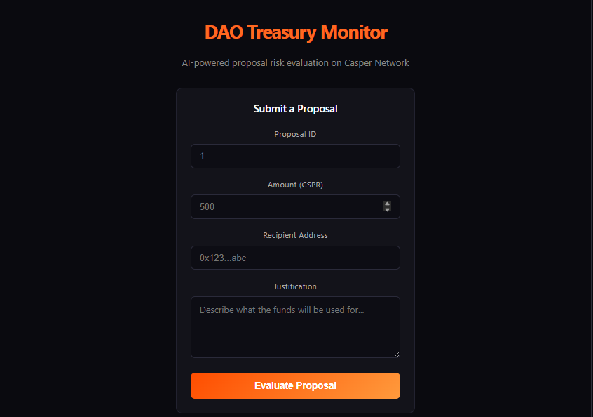

# DAO Treasury Monitor

**AI-powered proposal risk evaluation on Casper Network**

An agentic system that flags risky DAO treasury proposals before funds move - combining deterministic on-chain rules with LLM qualitative analysis for a two-layer risk verdict.

Live Demo: https://dao-monitor.vercel.app



---

## The Problem

DAO treasuries often approve funding proposals on trust and social consensus alone. There is rarely a consistent, automated check for oversized asks, vague justifications, or first-time recipients until funds have already moved. By then, reversing the decision is difficult or impossible.

---

## What It Does

DAO Treasury Monitor evaluates every proposal through two independent layers before a verdict is returned:

**Layer 1: Deterministic Rule Check**

Three rules run first, mirroring the logic encoded in the on-chain smart contract:

| Rule | Condition | Verdict |
|---|---|---|
| Amount threshold | Proposal exceeds the DAO's configured limit (default: 1,000 CSPR) | FLAGGED |
| Justification quality | Justification text is fewer than 10 characters | FLAGGED |
| Recipient history | Recipient address is not in the DAO's known-address registry | FLAGGED |

If any rule fires, the proposal is flagged with a plain-language reason. All three rules must pass for a proposal to be considered clean.

**Layer 2: AI Qualitative Analysis**

After the rule check, the justification text is sent to an LLM via OpenRouter. The model is prompted to act as a DAO treasury risk analyst and assess whether the justification is a genuine, specific funding rationale or vague, suspicious boilerplate. This catches intent-level problems that deterministic rules cannot.

The final verdict combines both layers: a rule result (FLAGGED / CLEAN with reasons) plus a one-sentence AI opinion on the quality of the justification.

---

## Architecture

```
+------------------+       POST /evaluate        +------------------------+
|    React UI      |  --------------------------> |   Off-chain Agent      |
|  (Vite, port     |  <-------------------------- |  (Node/Express, 4000)  |
|   5173)          |    { flagged, verdict,        |                        |
+------------------+      aiOpinion }              |  1. Rule check         |
                                                    |  2. OpenRouter LLM    |
                                                    +------------------------+

+---------------------------------------------------------+
|  DaoMonitor Smart Contract (Rust/Odra)                  |
|  Deployed on Casper Testnet                              |
|                                                           |
|  - evaluate_proposal()  runs rules on-chain               |
|  - register_address()   adds to known-address list        |
|  - get_verdict()        retrieves stored verdict          |
|                                                           |
|  Permanent on-chain audit trail of every verdict          |
+---------------------------------------------------------+
```

**Current state:** The off-chain agent queries the deployed DaoMonitor contract on Casper Testnet directly for Rule 3 (recipient history), using the Casper JS SDK. The on-chain contract and the off-chain agent now share one source of truth; the agent's rule check reads live contract state, and every verdict is stored permanently on-chain as an auditable trail.

Local vs. live deployment: The diagram above reflects the local dev setup (UI on port 5173, agent on port 4000). In the live demo, the same architecture is split across two hosts: the React UI is deployed on Vercel, and the off-chain agent runs on Render. The UI calls the Render-hosted agent over HTTPS instead of localhost:4000.

---

## Live Deployment

The DaoMonitor contract is deployed and verified on Casper Testnet.

| Field | Value |
|---|---|
| Contract Package Hash | `d1c56241f681405a5f57adc4021e3a642d5c24cd006815e332d59783aef252dd` |
| Deploy Transaction | [View on testnet.cspr.live](https://testnet.cspr.live/deploy/52c0252373a1a62a0f7916da28e3261fc6d3e3c72bdda767aa1693ca73cebe21) |
| Network | Casper Testnet (`casper-test`) |
| Protocol Version | 2.2.2 |

The full application (UI + agent) is also live at https://dao-monitor.vercel.app. The agent runs on Render's free tier, which spins down after inactivity; the first request may take 30–50 seconds while the instance wakes up; subsequent requests are fast.

---

## Setup & Usage

### Prerequisites

- [Node.js](https://nodejs.org/) v18+
- [Rust](https://rustup.rs/) + Cargo
- An [OpenRouter](https://openrouter.ai/) API key

### 1. Clone the repo

```bash
git clone https://github.com/Terese678/dao-monitor.git
cd dao-monitor
```

### 2. Configure the agent

Create `agent/.env`:

```env
OPENROUTER_API_KEY=your_openrouter_api_key_here
```

### 3. Start the agent (Terminal 1)

```bash
cd agent
npm install
npm start
```

You should see: `Agent server running on http://localhost:4000`

### 4. Start the UI (Terminal 2)

```bash
cd ui
npm install
npm run dev
```

Open `http://localhost:5173` in your browser.

### 5. Evaluate a proposal

Fill in the form fields and click **Evaluate Proposal**. The verdict panel will appear with:

- A **FLAGGED** or **CLEAN** status badge
- The specific rule(s) that fired (if any)
- A one-sentence AI qualitative opinion on the justification

**Try a FLAGGED case:** Amount `5000`, Recipient `unknown_addr`, Justification `pls approve`

**Try a CLEAN case:** To test the CLEAN path, a recipient address must first be registered on-chain via the contract's `register_address()` entry point. Once registered, that address will pass Rule 3 and — with a valid amount and justification — return a CLEAN verdict. The contract package hash for direct interaction is `d1c56241f681405a5f57adc4021e3a642d5c24cd006815e332d59783aef252dd` on Casper Testnet.

---

## Quick CLI Test (no UI required)

To test the agent logic directly in the terminal without starting the UI:

```bash
cd agent
node index.js
```

This runs three built-in test cases (oversized, clean, weak justification) and prints the full verdict for each to the console.

---

## Tests

The smart contract ships with unit tests covering both verdict branches:

```bash
cargo test
```

- `flags_oversized_unjustified_proposal_from_unknown_address` - verifies all three rules fire correctly on a bad proposal
- `clears_reasonable_proposal_from_registered_address` - verifies a well-formed proposal from a known address passes clean

---

## Tech Stack

| Layer | Technology |
|---|---|
| Smart contract | Rust, [Odra Framework](https://odra.dev) 2.8.2 |
| Blockchain | Casper Network (Testnet) |
| Off-chain agent | Node.js, Express 5 (hosted on Render) |
| AI / LLM | OpenRouter (`openrouter/auto`) |
| Frontend | React, Vite (hosted on Vercel) |
---

## Roadmap

- **Threshold configuration via contract** - expose the amount threshold as an on-chain parameter so DAOs can set their own limit without redeploying
- **Known-address management UI** - let DAO admins register and remove trusted addresses through the frontend

---

## Built For

[Casper Agentic Buildathon](https://dorahacks.io) - an AI-powered agentic system with a transaction-producing on-chain component on Casper Network.